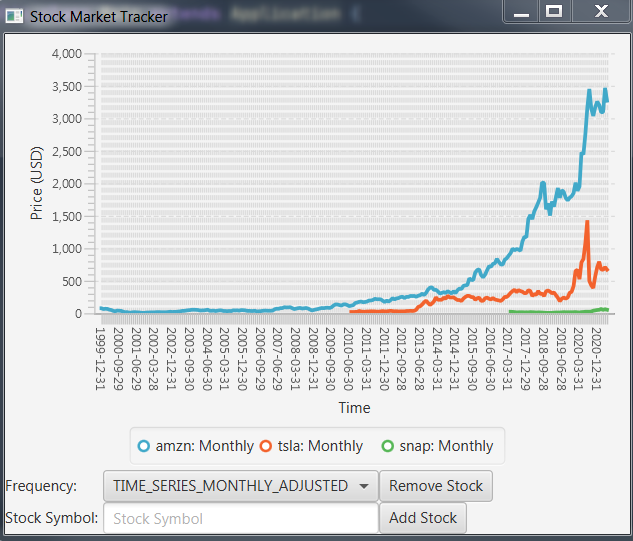

# Stock Market Tracker
- [x] Your projects must use the techniques listed (+30)  
	-  JavaFX 
	-  IO online  
	-  Json
	- **javafx linechart**
- [x] Your project  must  also  use  at  least  one  inner  class  and  one  lambda  expression.(+10)  
- [x] Your project will use something we have not covered in class (in bold). (+20)  
- [x] Your must have a Readme.md file in your repository, indicating:  
	- What your project is,  
	- what the program does, and then,  
	- a technical section indicating the classes, and methods in which the above requirements are contained.  
	- You must also indicate which is the main class to run the program.(+10)  
- [x] Your project must compile.(+10)  
- [x] Your project must work as specified by the previous section and according to your readme.md file. (+20)

## Readme
Project Topic #3: A stock market tracker: Can check whatever stock using https://www.alphavantage.co/ and plots its trend. 

### Usage
Stock Market Tracker can be used to view and compare the trends of the closing price of a stock over time. A user can add or remove a stock to the graph by following these steps:
#### Add a Stock
1. Select a Frequency by selecting a 'Weekly' or 'Monthly' series using the dropdown menu
1. Type in the desired stock in the 'Stock Symbol' text field
1. Click 'Add Stock' button
#### Remove a Stock
1. Click the 'Remove Stock' button to remove a stock from the graph
### Technical Overview
Description of classes and methods
#### Main
The Main class contains the entire application (except for json_simple). It extends the javafx.Application class and has the following methods:

| Method              | Visibility |         (Parameters) : Return          | Description                                                                                   |
| ------------------- | ---------- |:--------------------------------------:| --------------------------------------------------------------------------------------------- |
| start               | public     |             (Stage) : void             | initializes the JavaFX application; defines, constrains and displays elements; uses ==lambdas==                 |
| formUrl             | private    |             (funcs) : void             | creates the API request URL                                                                   |
| url2json            | private    |            ( ) : JsonObject            | queries the API and returns a JSON object that represents the API response                    |
| getPriceData        | private    |   (JsonObject) : Arraylist<String[]>   | converts the JSON object into an ArrayList, which makes it easier to process the pricing data |
| ~~getOverviewData~~ | private    | (JsonObject) : HashMap<String, String> | returns data about the company                                                                |
| main                | public     |           (string[]) : void            | ==used to run the program==; calls `launch` method (required to launch standalone app)        |

#### Main > linechart
linechart is an ==inner class== of Main and is used to create and use LineChart objects. It has the following two methods:

| Method    | Visibility | (Parameters) : Return | Description                                                                               |
| --------- | ---------- |:---------------------:| ----------------------------------------------------------------------------------------- |
| linechart | public     |     *constructor*     | initializes a new `LineChart` object                                                      |
| addSeries | private    |      ( ) : void       | uses `formURL`, `getPriceData` and `url2json` to add a new series to the member linechart |

#### json_simple
json_simple is used to process json objects. Stock Market Tracker uses the `JsonObject` class to parse API results.
